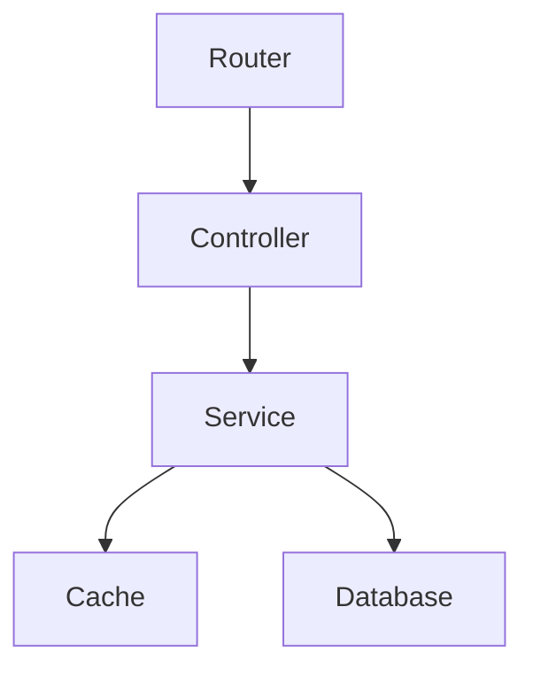
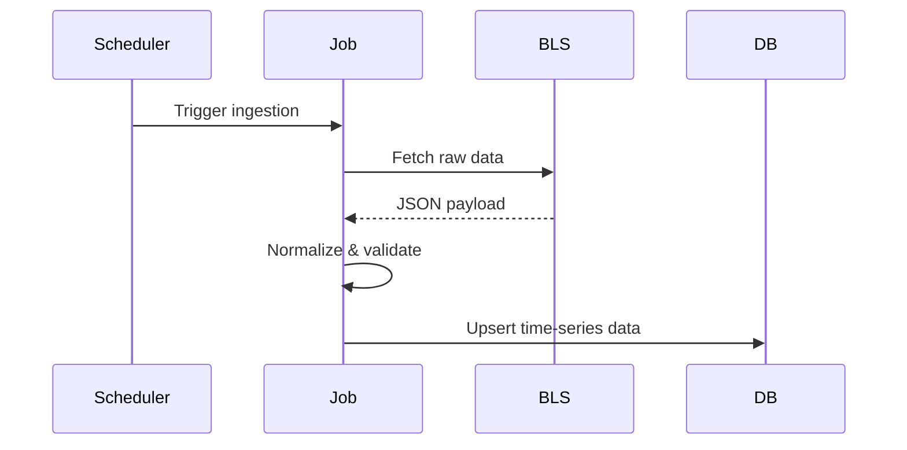
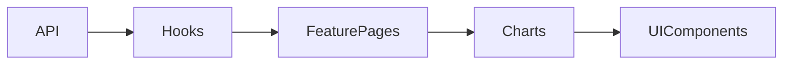

# U.S. Economic Dashboard – System Architecture

## 1. High-Level Overview

The U.S. Economic Dashboard is a **data-ingestion–driven analytics platform** designed to:

- Ingest authoritative public economic data (BLS, Census)
- Normalize and persist time-series economic indicators
- Serve a stable, cached API for dashboards and analysis
- Provide a professional, extensible React-based visualization layer

The system follows a **clean separation of concerns**:

- **Ingestion Layer**: Background jobs fetch and normalize raw data
- **Persistence Layer**: PostgreSQL stores structured time-series data
- **API Layer**: REST API exposes read-optimized endpoints
- **Frontend Layer**: React dashboard consumes API and visualizes data

## 2. System Architecture Diagram

```mermaid
flowchart LR
    subgraph External Providers
        BLS[Bureau of Labor Statistics API]
        Census[US Census API]
    end

    subgraph Ingestion
        Jobs[Background Ingestion Jobs]
    end

    subgraph Storage
        PG[(PostgreSQL)]
        Redis[(Redis Cache)]
    end

    subgraph API
        API[Core Data API Service]
    end

    subgraph Frontend
        UI[React Dashboard]
    end

    BLS --> Jobs
    Census --> Jobs
    Jobs --> PG
    PG --> API
    API --> Redis
    Redis --> API
    API --> UI
```

## 3. Backend Architecture

### 3.1 Backend File Structure

```
core-data-api-service/
├── src/
│   ├── api/
│   │   └── v1/
│   │       ├── data.router.js
│   │       ├── geo.router.js
│   ├── controllers/
│   │   ├── data.controller.js
│   │   ├── geo.controller.js
│   ├── services/
│   │   ├── data.service.js
│   │   ├── cache.service.js
│   │   ├── db.service.js
│   │   ├── bls.service.js
│   │   ├── census.service.js
│   ├── jobs/
│   │   ├── bls.ingestion.job.js
│   │   ├── census.ingestion.job.js
│   │   └── scheduler.js
│   ├── middleware/
│   │   ├── auth.middleware.js
│   │   ├── error.middleware.js
│   │   ├── logger.middleware.js
│   ├── utils/
│   │   ├── validator.js
│   │   ├── constants.js
│   ├── config/
│   │   ├── db.config.js
│   │   ├── redis.config.js
│   │   ├── env.config.js
│   ├── server.js
├── Dockerfile
├── README.md
```

### 3.2 Architectural Pattern: Layered + Service-Oriented

The backend follows a **layered architecture**:



#### Why this pattern?

* **Controllers** remain thin and HTTP-focused
* **Services** encapsulate business logic and data access
* **Routers** provide versioning and clean API evolution
* **Jobs** are isolated from request-response lifecycles

## 4. Data Ingestion Architecture

### 4.1 Background Job Design

Economic data ingestion is **decoupled from API traffic**.



### Why background jobs?

* Avoids rate-limiting during API requests
* Ensures deterministic data freshness
* Enables retry and backfill strategies
* Keeps API read-only and stable

### 4.2 Data Normalization Strategy

All ingested data is normalized into a common schema:

| Field       | Purpose                      |
| ----------- | ---------------------------- |
| `metric`    | GDP, CPI, Unemployment, etc. |
| `geo_level` | national / state / county    |
| `geo_id`    | FIPS or ISO identifier       |
| `date`      | Observation date             |
| `value`     | Numeric measurement          |
| `source`    | bls / census                 |

This allows:

* Uniform querying across datasets
* Easy extension to new providers
* Time-series analytics without schema changes

## 5. Persistence Layer

### PostgreSQL (Primary Store)

PostgreSQL is used because:

* Strong consistency
* Excellent time-series performance
* Rich indexing (date, geo, metric)
* SQL analytics support

Example table conceptually:

```sql
economic_data (
  id UUID PK,
  metric TEXT,
  geo_level TEXT,
  geo_id TEXT,
  date DATE,
  value NUMERIC,
  source TEXT,
  created_at TIMESTAMP
)
```
### Redis (Cache Layer)

Redis is used for:

* Hot-path API reads
* Reducing database load
* Improving dashboard latency

Cache strategy:

* Read-through cache
* TTL-based invalidation
* Keyed by `metric:geo_id`

## 6. API Layer

### REST API Design

Versioned endpoints ensure long-term compatibility:

```
/api/v1/data/national/{metric}
/api/v1/data/state/{stateId}/{metric}
/api/v1/geo/states
```

#### Design principles:

* Read-optimized
* Deterministic responses
* Cache-friendly
* Explicit versioning


## 7. Frontend Architecture

### 7.1 Frontend File Structure

```
economic-dashboard-ui/
├── src/
│   ├── api/
│   ├── components/
│   │   ├── layout/
│   │   ├── charts/
│   │   └── ui/
│   ├── features/
│   │   ├── dashboard/
│   │   ├── states/
│   ├── routes/
│   ├── types/
│   ├── utils/
│   ├── App.tsx
│   ├── main.tsx
```

### 7.2 Frontend Architectural Pattern

The frontend uses a **feature-based architecture**:



#### Why this structure?

* Prevents monolithic component trees
* Enables independent feature growth
* Improves testability
* Encourages reusable UI primitives


### 7.3 State Management Strategy

* **React Query** for server state
* No global Redux store (intentionally)
* Cached, retryable, background-updated queries

This matches the **read-heavy analytics workload** of dashboards.


## 8. Security & Operational Considerations

* API keys stored via environment variables
* JWT-ready middleware (optional)
* No direct frontend-to-provider calls
* Providers isolated behind ingestion layer
* Dockerized for reproducibility

## 9. Scalability & Future Extensions

This architecture is intentionally designed to scale:

### Easy additions

* New economic providers (FRED, BEA)
* WebSockets for real-time indicators
* Scheduled reprocessing
* Public API consumers
* Authenticated user dashboards

### Horizontal scaling

* Stateless API
* Cache-backed reads
* Job workers can be scaled independently

## 10. Architectural Summary

| Layer     | Responsibility                       |
| --------- | ------------------------------------ |
| Ingestion | Fetch & normalize authoritative data |
| Storage   | Persist structured time-series       |
| API       | Serve cached, versioned data         |
| Frontend  | Visualize insights clearly           |

This design prioritizes:

* **Correctness over speed**
* **Clarity over cleverness**
* **Long-term maintainability**