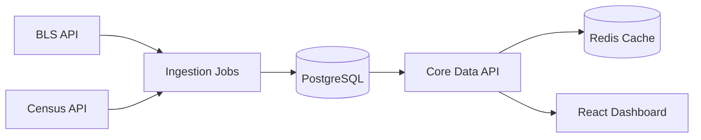

# U.S. Economic Dashboard

A full-stack platform for ingesting, persisting, and visualizing authoritative United States economic data from public sources such as the **Bureau of Labor Statistics (BLS)** and the **U.S. Census Bureau**.

This project is designed as a **production-quality, extensible analytics system**, suitable for dashboards, research, policy analysis, and future public APIs.

## Key Features

### Data Ingestion
- Automated background ingestion from:
  - Bureau of Labor Statistics (BLS)
  - U.S. Census Bureau
- Normalized time-series data model
- Scheduled and idempotent ingestion jobs
- Safe retry and backfill support

### Persistence
- PostgreSQL as the primary data store
- Structured, query-optimized economic time series
- Indexed by metric, geography, and date
- Redis caching for hot-path API reads

### API Layer
- Versioned REST API (`/api/v1`)
- National, state, and geographic endpoints
- Read-optimized and cache-aware
- Stateless and horizontally scalable

### Frontend Dashboard
- Professional React + TypeScript dashboard
- Clean, enterprise-grade UI
- Interactive charts and metrics
- Feature-based frontend architecture
- Optimized server-state management with React Query

### Infrastructure-Ready
- Dockerized backend
- Environment-driven configuration
- Clear separation of ingestion, API, and UI concerns

---

## High-Level Architecture


## Repository Structure

```
.
├── core-data-api-service/     # Backend API + ingestion
│   ├── src/
│   │   ├── api/               # Versioned API routes
│   │   ├── controllers/       # Request orchestration
│   │   ├── services/          # Business logic & providers
│   │   ├── jobs/              # Background ingestion jobs
│   │   ├── middleware/        # Logging, errors, auth
│   │   ├── utils/             # Validation & constants
│   │   ├── config/            # Environment & DB config
│   │   └── server.js
│   ├── Dockerfile
│   └── README.md
│
├── economic-dashboard-ui/     # React frontend
│   ├── src/
│   │   ├── api/               # API clients
│   │   ├── components/        # Layout, charts, UI primitives
│   │   ├── features/          # Feature-based pages
│   │   ├── routes/            # App routing
│   │   ├── types/             # Shared TypeScript types
│   │   └── App.tsx
│   └── README.md
│
├── ARCHITECTURE.md
├── CONTRIBUTING.md
└── README.md
```

## Backend Overview

### Core Responsibilities

* Serve normalized economic data via REST
* Cache frequently accessed metrics
* Isolate provider complexity from consumers
* Maintain API stability and versioning

### Example Endpoints


GET /api/v1/data/national/{metric}
GET /api/v1/data/state/{stateId}/{metric}
GET /api/v1/geo/states

### Supported Metrics (v1)

* GDP
* CPI
* Unemployment Rate
* Population (Census)

## Data Ingestion

### Ingestion Strategy

* Background jobs run independently of API traffic
* Provider-specific services handle raw API formats
* All data normalized into a unified schema
* Idempotent writes ensure safe reprocessing

### Why Background Jobs?

* Avoids rate limits during user requests
* Improves reliability and performance
* Enables historical backfills and retries
* Keeps API read-only and predictable

## Frontend Overview

### Design Principles

* Clear separation of concerns
* Feature-based organization
* Minimal global state
* Professional visual presentation

### Key Technologies

* React 18
* TypeScript
* React Query
* Recharts
* TailwindCSS
* Vite

### Example Features

* National economic overview
* Time-series visualization
* Cached and reactive API calls

## Local Development

### Prerequisites

* Node.js 18+
* PostgreSQL 14+
* Redis
* Docker (optional)

---

### Backend Setup

```bash
cd core-data-api-service
npm install
cp .env.example .env
npm run dev
```

### Frontend Setup

```bash
cd economic-dashboard-ui
npm install
cp .env.example .env
npm run dev
```

## Environment Variables

### Backend

```
DATABASE_URL=postgres://...
REDIS_URL=redis://...
BLS_API_KEY=your_key
CENSUS_API_KEY=your_key
```

### Frontend

```
VITE_API_BASE_URL=http://localhost:4000/api/v1
```
## Docker

The backend is fully Docker-compatible:

```bash
docker build -t economic-api .
docker run -p 4000:4000 economic-api
```
## Design Philosophy

This project prioritizes:

* **Correctness over shortcuts**
* **Explicit architecture over magic**
* **Separation of ingestion and consumption**
* **Long-term maintainability**

It is intentionally designed to grow into:

* A public economic data API
* A policy analysis platform
* A research dashboard
* A teaching and demonstration system

## Documentation

* `ARCHITECTURE.md` – Complete system design and diagrams
* `CONTRIBUTING.md` – Development and contribution guidelines

## Roadmap

* State-level dashboards
* Interactive geographic maps
* Additional providers (BEA, FRED)
* Historical trend comparisons
* User-defined dashboards
* Public API documentation

## License

MIT License

## Disclaimer

This project consumes publicly available government data.
It does not represent official government analysis or endorsement.

## Maintainers

Project maintained by contributors focused on:

* Data engineering
* Systems architecture
* Economic visualization

Contributions are welcome.

